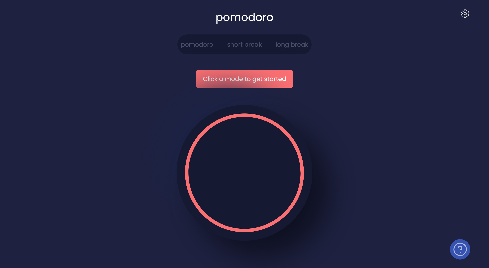

# pomodoro-timer
A minimal pomodoro timer created using HTML, CSS and JavaScript

## Screenshots

## Features
- Choose between pomodoro, short break and long break modes
- From selected mode, countdown until 0
- Show timer progress in tab title
- Play sound when timer finishes

## Technologies
- HTML5
- CSS3
- JavaScript (ES6)

## Inspiration
This application is based on a [FrontEndMentor challenge](https://www.frontendmentor.io/challenges/pomodoro-app-KBFnycJ6G).

The changes made were to reduce the number of additional interactions, putting the focus on work and productivity - while keeping a minimal interface.
